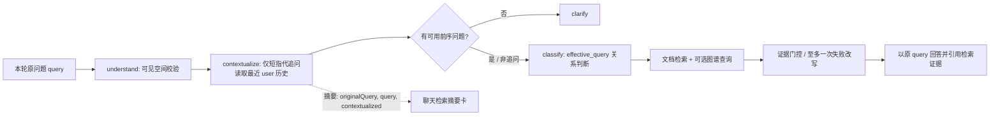

# 会话感知检索实施计划

> **给执行 Agent：** 执行本计划必须使用 `superpowers:executing-plans`，逐项完成并勾选任务；每个任务完成后先运行其指定验证，再继续下一项。

**目标：** 让当前 Redis 会话中的上一轮用户问题参与检索词构造，使“它是谁负责的？”这类上下文追问检索到正确的文档和图谱证据，同时保留原问题作为回答对象、现有 ACL、引用和一次失败检索改写的行为。

**架构：** 在现有 LangGraph `understand` 与 `retrieve` 之间插入纯确定性的 `contextualize` 节点。节点只在短小的指代式追问上读取已有 `history` 的最近一条用户消息；它构造供文档检索、图谱查询和证据重排使用的 `effective_query`。回答提示词始终使用用户本轮原问题 `query`，并继续携带原始会话历史。检索摘要在现有 NDJSON / AI SDK data part 中同时暴露原问题、实际检索词与是否发生上下文化，聊天页仅扩展已有摘要卡。

**技术栈：** Python 3.12、LangGraph、FastAPI、Redis 短期会话记忆、Zod、NestJS、React、Vercel AI SDK、pytest、Vitest。

## 一、边界与决策

### 本次交付

- 仅使用同一用户、同一会话、已由 `routes/runs.py` 合并并传入 Agent 的 Redis 短期历史；不新增存储、数据表、迁移、外部模型或依赖。
- 仅在本轮问题是短小、以现有 `ORPHAN_REFERENCES` 开头的指代式追问时上下文化；普通独立问题保持字面检索词不变。
- 只拼入最近一条非空的 **用户** 历史消息，并清理空白、截断至 500 个字符。禁止以模型生成的 assistant 消息做检索锚点，避免错误回答反向污染后续召回。
- 构造式固定为 `上一轮问题 + "\n追问：" + 本轮问题`，不使用 LLM 改写。这样向量和关键词检索都能保留被指代实体与当前意图，且执行路径可复现。
- 先完成上下文化，再以 `effective_query` 做关系意图识别；把“负责”加入图谱关系关键词，确保“它是谁负责的？”在已解析时并行查询图谱。
- 现有 `rewrite` 节点仍只处理证据不足后的最多一次改写；上下文化不计入 `rewrite_count`，不会改变其重试上限。
- 让回答 prompt 使用原始 `query`，让引用仍只来自实际检索到的文档 / 图谱证据；不得把历史内容伪装成证据或直接写进回答。
- 检索摘要 `query` 保持“实际检索词”的既有语义，新增 `originalQuery`、`contextualized` 和已存在于 Python 摘要但未被 TypeScript 契约声明的 `attempt`，保证跨服务严格校验一致。
- 评测请求的每个 case 增加可选 `history`，仅在 `full` 模式下传给 `Agent.run_evaluation`；`retrieval` 直连服务模式仍使用 case 的原问题，避免把 Agent 编排行为误计入基础检索指标。

### 明确不做

- 不接入 Mem0、跨会话长期记忆、个人画像、组织记忆、记忆写入 / 遗忘 / 管理 UI。
- 不增加 LLM 查询改写、复杂意图分类器、Langfuse、Deep Agents 或多跳规划。
- 不改变空间隔离、ACL 过滤、会话 TTL、历史窗口、文档 / 图谱数据模型及公共聊天请求协议。
- 不给持久化评测题库新增会话历史字段；这会引入数据库迁移且超出本次 RAG 主链路范围。评测仍通过 `Agent.run_evaluation(history=...)` 的内部单测覆盖上下文化结果，页面继续显示已有 `effectiveQuery`。
- 不在失败检索时从 assistant 回复补全实体；无历史的指代追问仍走澄清，不猜测实体。

## 二、目标流程



## 三、任务拆分

### 任务 1：建立确定性的会话检索词解析器与路由单测

**文件：**

- 新建：`services/ai/src/rag_ai/agent/conversation.py`
- 修改：`services/ai/src/rag_ai/agent/decision.py`
- 新建：`services/ai/tests/test_agent_conversation.py`
- 修改：`services/ai/tests/test_agent_decision.py`

- [ ] **步骤 1：先写解析器的失败测试。**

  在 `test_agent_conversation.py` 覆盖以下固定输入：

  1. 历史最后一条用户问题为“采购申请由谁审批？”，本轮“它是谁负责的？”返回 `effective_query == "采购申请由谁审批？\n追问：它是谁负责的？"` 且 `contextualized is True`。
  2. 历史同时包含 assistant 回复时，解析器仍只选最近 user 消息。
  3. 普通独立问题不改变检索词且 `contextualized is False`。
  4. 指代追问没有 user 历史时返回“需要澄清”的显式结果，不返回猜测的实体。
  5. 多余空白会规范化；过长的前序用户问题按 500 字符截断。

- [ ] **步骤 2：实现小而纯的解析器。**

  在 `conversation.py` 定义不可变的 `ConversationResolution`：

  ```python
  @dataclass(frozen=True)
  class ConversationResolution:
      effective_query: str
      contextualized: bool
      needs_clarification: bool
  ```

  导出 `resolve_retrieval_query(query: str, history: list[ChatMessage])`。提取与既有 `ORPHAN_REFERENCES` 相同的“短且以指代词开头”判定到可复用 helper，避免 `decision.py` 与解析器出现两套不一致规则。解析器不得访问 Redis、模型、数据库或图谱服务。

- [ ] **步骤 3：收紧 `classify_question` 的职责。**

  将它改为只接收一个已经解析 / 规范化的查询及 `has_visible_space`；无可见空间仍拒答，关系词仍决定 `use_graph`。不再由它根据 history 判定澄清。将“负责”加入 `RELATION_TERMS`，并将“无历史指代问题会澄清”的覆盖转至解析器测试。补充断言：解析后的“采购申请由谁审批？\n追问：它是谁负责的？”必须 `use_graph is True`。

- [ ] **步骤 4：执行局部验证。**

  ```powershell
  uv run --project services/ai pytest services/ai/tests/test_agent_conversation.py services/ai/tests/test_agent_decision.py -q
  uv run --project services/ai ruff check src/rag_ai/agent/conversation.py src/rag_ai/agent/decision.py tests/test_agent_conversation.py tests/test_agent_decision.py
  ```

  预期：测试全绿、Ruff 无告警。

### 任务 2：将上下文化纳入 LangGraph 并保持回答语义

**文件：**

- 修改：`services/ai/src/rag_ai/agent/graph_state.py`
- 修改：`services/ai/src/rag_ai/agent/workflow.py`
- 修改：`services/ai/src/rag_ai/agent/runner.py`
- 修改：`services/ai/tests/test_agent_workflow.py`

- [ ] **步骤 1：扩展图状态和初始化。**

  在 `AgentGraphState` 加入 `contextualized: bool`。在 `_initial_state` 中将它设为 `False`；保留 `query` 为不可变的用户本轮原问题、`effective_query` 为可变的检索词。

- [ ] **步骤 2：显式增加 `contextualize` 图节点。**

  图变为 `START -> understand -> contextualize -> conditional(route) -> ...`：

  - `_understand` 仅发送状态并计算 `has_visible_space` / 早期拒答 profile；空间不可见时直接设定 refuse，不读取会话内容。
  - `_contextualize` 在可见空间下调用 `resolve_retrieval_query`；无前序 user 信息的指代问题生成 clarify profile；其余情况用解析后的 `effective_query` 调用 `classify_question`。
  - 节点返回 `effective_query`、`contextualized`、`profile`，不修改 `history`。
  - `_retrieve` 的 custom retrieval 事件同时携带 `original_query=state["query"]` 和 `contextualized`。
  - `_answer` 调用 `_build_prompt(state["query"], context)`，而不是 `effective_query`。回答面向用户的表述保持“它是谁负责的？”，但证据由上下文化检索得到。
  - `_rewrite` 继续基于当前 `effective_query` 运行，且不触碰 `contextualized`。

- [ ] **步骤 3：先扩展测试替身并写端到端工作流测试。**

  令 `_Retrieval` 保存收到的 `queries: list[str]`，令 `_GraphTool` 保存查询参数，令 `_Chat` 保存最后一次 messages。新增测试覆盖：

  1. 有历史的指代追问只检索一次，文档与图谱工具都收到拼接后的有效检索词。
  2. 该 run 的 `retrieval.summary` 内部事件可带出原问题与 `contextualized=True`。
  3. Chat prompt 的 `Question:` 段仍是原问题，且证据引用照常产生。
  4. 无历史的指代追问不调用检索或图谱工具，输出澄清答案。
  5. 现有独立关系问题仍只使用其自身问题作为检索词，保持回归行为。

- [ ] **步骤 4：支持可选历史的内部评测调用。**

  给 `Agent.run_evaluation` 添加 keyword-only `history: list[ChatMessage] | None = None`，传入 `_initial_state`。默认 `None` 等价现状的空数组，保证所有既有调用兼容。为该路径加入一个直接调用的断言，验证返回的 `AgentResult.effective_query` 是上下文化后的值。

- [ ] **步骤 5：执行 Python 相关验证。**

  ```powershell
  uv run --project services/ai pytest services/ai/tests/test_agent_conversation.py services/ai/tests/test_agent_decision.py services/ai/tests/test_agent_workflow.py -q
  uv run --project services/ai ruff check src/rag_ai/agent tests/test_agent_conversation.py tests/test_agent_decision.py tests/test_agent_workflow.py
  ```

  预期：上下文追问、图谱并发、澄清、取消和既有关系检索全部通过。

### 任务 3：让检索摘要、聊天 UI 与评测中心可观察

**文件：**

- 修改：`packages/contracts/src/agent-events.ts`
- 修改：`packages/contracts/fixtures/agent-events.jsonl`
- 修改：`packages/contracts/test/agent-events.spec.ts`
- 修改：`apps/web/src/features/chat/message-part.tsx`
- 修改：`apps/web/src/features/chat/message-part.spec.tsx`
- 修改：`apps/api/src/ai/ai-stream.mapper.spec.ts`
- 修改：`services/ai/src/rag_ai/agent/runner.py`
- 修改：`services/ai/src/rag_ai/routes/search_test.py`
- 修改：`apps/api/src/evaluation/evaluation.service.ts`（仅在其 case DTO / 转发层需要声明新增 `history` 时）
- 修改：`apps/web/src/features/evaluation/evaluation-page.tsx`（仅在其导入 / 表单 schema 需要暴露 case history 时；不增加复杂编辑器）

- [ ] **步骤 1：收紧并统一摘要协议。**

  在 TypeScript `retrievalSummary` strict Zod schema 增加：

  ```ts
  originalQuery: z.string(),
  contextualized: z.boolean(),
  attempt: z.int().positive(),
  ```

  在 Python `_summary_to_event` 接收并写出同名字段。注意 Python 的 `RetrievalSummary` 事件当前允许字典，所以契约真正规约束点在 TypeScript；fixture 必须同步更新，且不得在 mapper 中额外拼接或丢弃字段。

- [ ] **步骤 2：在已有聊天检索摘要卡展示两种问题。**

  当 `summary.contextualized` 为真时，卡片显示：

  - “原问题：{originalQuery}”
  - “实际检索词：{query}”

  否则继续只显示现有“查询：{query}”。不显示用户 ID、会话 ID、ACL、完整历史或 assistant 消息。更新组件测试，分别断言上下文化和普通查询的渲染。

- [ ] **步骤 3：为评测 case 提供可选会话历史。**

  在 Python `EvaluationCase` 中新增 `history: list[ChatMessage] = []` 的等价 Pydantic 结构（使用已有 role / content 限制，避免接受任意对象）；`_evaluate_case` 只在 `full` 模式将其传给 `agent.run_evaluation(history=...)`。检查 NestJS 评测 DTO、服务转发和网页上传 / 表单类型：若它们已透传 JSON case 则只同步类型；若严格 schema 丢弃字段，则加同样的可选 history 字段。评测结果继续复用已有 `effectiveQuery` 显示，无需新表字段。

- [ ] **步骤 4：补齐跨层测试。**

  - contracts fixture 测试解析新增字段，并验证 strict schema 仍拒绝未声明字段；
  - `AiStreamMapper` 测试将一条 `retrieval.summary` 映射为完整的 `data-retrieval-summary`，字段无丢失；
  - 聊天组件测试覆盖上下文化摘要的双行文案；
  - Python 路由 / 评测单测（如现有测试文件覆盖）断言 full case 能将 history 传到 Agent，retrieval-only 不传。

- [ ] **步骤 5：执行前端与契约验证。**

  ```powershell
  pnpm --filter @rag/contracts test
  pnpm --filter @rag/api test -- ai-stream.mapper.spec.ts
  pnpm --filter @rag/web test -- message-part.spec.tsx
  pnpm typecheck
  ```

  预期：严格事件契约、AI SDK data part 类型、聊天摘要渲染和全仓 TypeScript 类型检查全部通过。

### 任务 4：更新现状文档、做完整回归并提交

**文件：**

- 修改：`README.md`
- 修改：`docs/architecture/008-langgraph-main-flow.md`
- 修改：`docs/superpowers/plans/2026-07-18-enterprise-rag-master-roadmap.md`
- 修改：`docs/superpowers/plans/2026-08-11-conversational-retrieval.md`

- [ ] **步骤 1：纠正项目当前能力描述。**

  README 不再声称“LangGraph 扩展路由仍在后续阶段”，改为：主流程已交付，并支持基于 Redis 会话短期历史的上下文追问检索；长期记忆仍是后续、需单独治理的项目。架构文档更新图节点、原问题 / 有效检索词的语义和摘要字段。总路线图将 LangGraph 与评测中心标为已完成 / 当前能力，并把长期记忆、Langfuse、Deep Agents 保留为明确的未开始后续项。

- [ ] **步骤 2：运行完整质量门禁。**

  ```powershell
  pnpm lint
  pnpm typecheck
  pnpm test
  pnpm build
  uv run --project services/ai pytest -q
  git diff --check
  git status --short
  ```

  预期：所有命令成功，`git diff --check` 无空白错误，变更仅限会话检索、对应契约 / UI / 评测、测试与文档；不得混入根工作区那份未跟踪的 LangGraph 设计草案。

- [ ] **步骤 3：人工体验验收。**

  在同一聊天会话、选择一个包含采购流程与负责人关系证据的知识空间：

  1. 发送“采购申请由谁审批？”；
  2. 随后发送“它是谁负责的？”；
  3. 验证摘要卡显示原问题和实际检索词、引用仍指向文档或图谱证据、答案回答当前追问；
  4. 新开会话直接发送“它是谁负责的？”，验证系统请求补充对象且不会检索猜测；
  5. 发送独立问题，验证摘要仅显示正常查询。

- [ ] **步骤 4：创建单一、可审阅提交。**

  ```powershell
  git add services/ai/src/rag_ai/agent services/ai/src/rag_ai/routes/search_test.py services/ai/tests packages/contracts apps/api/src/ai apps/web/src/features/chat apps/api/src/evaluation apps/web/src/features/evaluation README.md docs/architecture/008-langgraph-main-flow.md docs/superpowers/plans/2026-07-18-enterprise-rag-master-roadmap.md docs/superpowers/plans/2026-08-11-conversational-retrieval.md
  git commit -m "feat: add conversational retrieval context"
  ```

## 四、完成定义

- 会话内指代追问能用最近用户问题构造可审计的实际检索词，并在关系意图下同时调用文档与图谱查询。
- 无上下文的指代问题仍澄清，普通问题、ACL、取消、引用、失败重写和 Redis 会话范围无回归。
- 用户能在聊天的检索摘要卡中区分原问题和实际检索词；评测 full case 可以携带最小会话历史并显示 `effectiveQuery`。
- Python、契约、API、Web 的局部测试和完整质量门禁均通过后，才允许提交 / 推送 / 创建 PR。
